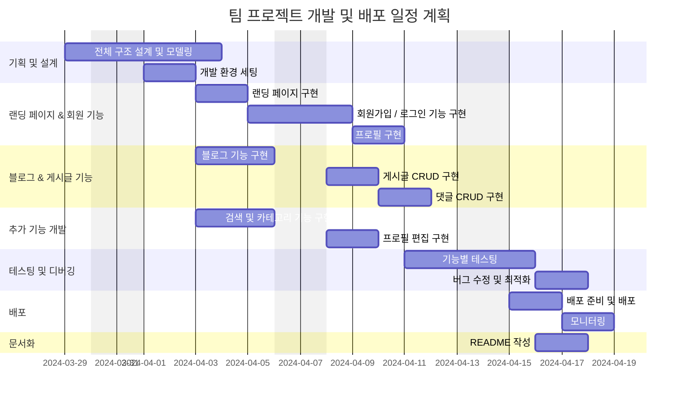

# WBS

```mermaid
gantt
    dateFormat  YYYY-MM-DD
    title 팀 프로젝트 개발 및 배포 일정 계획
    excludes weekends

    section 기획 및 설계
    전체 구조 설계 및 모델링         :des1, 2024-03-29, 4d
    개발 환경 세팅                 :set1, 2024-04-01, 2d

    section 랜딩 페이지 & 회원 기능
    랜딩 페이지 구현 :lan1, after set1, 2d
    회원가입 / 로그인 기능 구현   : lan2, after lan1, 2d
    프로필 구현      : lan3, after lan2, 2d

    section 블로그 & 게시글 기능
    블로그 기능 구현              :blog1, after set1, 3d
    게시글 CRUD 구현              : blog2, after blog1, 2d
    댓글 CRUD 구현      : blog3, after blog2, 2d

    section 추가 기능 개발
    검색 및 카테고리 기능 구현     :add1, after set1, 3d
    프로필 편집 구현         : add2, after add1, 2d

    section 테스팅 및 디버깅
    기능별 테스팅                :test1, 2024-04-11, 3d
    버그 수정 및 최적화          :test2, after test1, 2d

    section 배포
    배포 준비 및 배포       :deploy1, 2024-04-15, 2d
    모니터링      :deploy2, after deploy1, 2d
    
    section 문서화
    README 작성           : doc1, 2024-04-16, 2d


```
