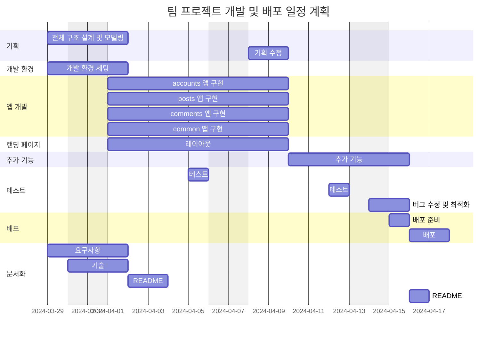

# WBS

```mermaid
gantt
    dateFormat  YYYY-MM-DD
    title 팀 프로젝트 개발 및 배포 일정 계획
    excludes weekends

    section 기획
    전체 구조 설계 및 모델링 :des1, 2024-03-29, 2d
    기획 수정 : 2024-04-08, 2d

    section 개발 환경
    개발 환경 세팅 :set1, 2024-03-29, 2d

    section 앱 개발
    accounts 앱 구현 :acc1, 2024-04-01, 7d
    posts 앱 구현 :pos1, 2024-04-01, 7d
    comments 앱 구현 :com1, 2024-04-01, 7d
    common 앱 구현 :comn1, 2024-04-01, 7d

    section 랜딩 페이지
    레이아웃 :lan1, 2024-04-01, 7d

    section 추가 기능
    추가 기능 : 2024-04-10, 4d

    section 테스트
    테스트 : 2024-04-05, 1d
    테스트 : 2024-04-12, 1d
    버그 수정 및 최적화 : 2024-04-14, 2d

    section 배포
    배포 준비 :deploy1, 2024-04-15, 1d
    배포 :deploy2, after deploy1, 2d
    
    section 문서화
    요구사항 : 2024-03-29, 1.5d
    기술 : 2024-03-30, 2d
    README : 2024-04-02, 2d
    README : doc1, 2024-04-16, 1d

```
